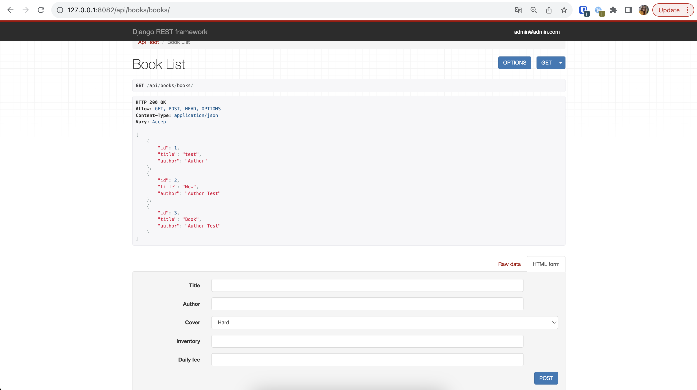
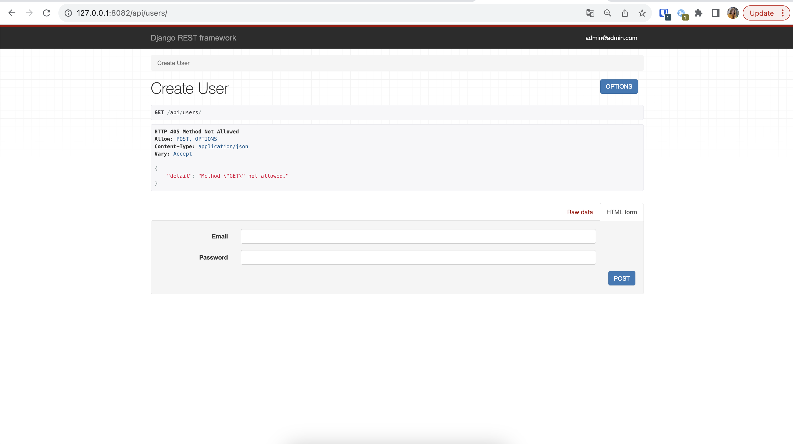
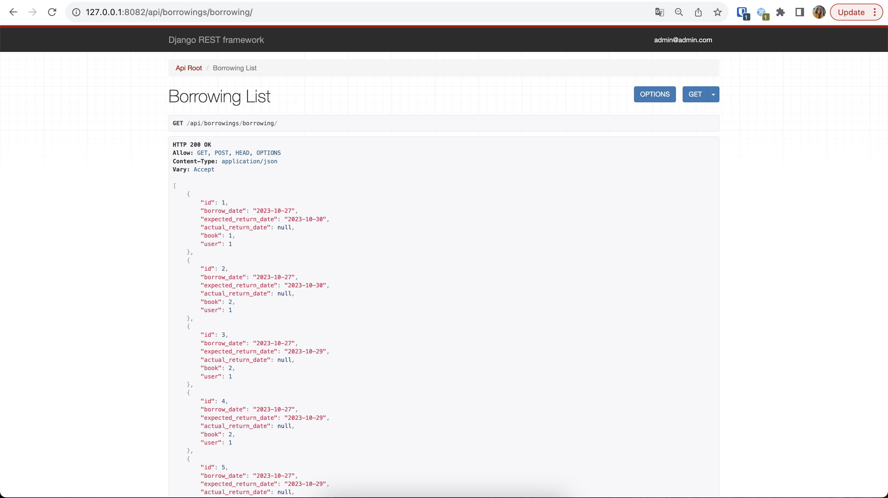
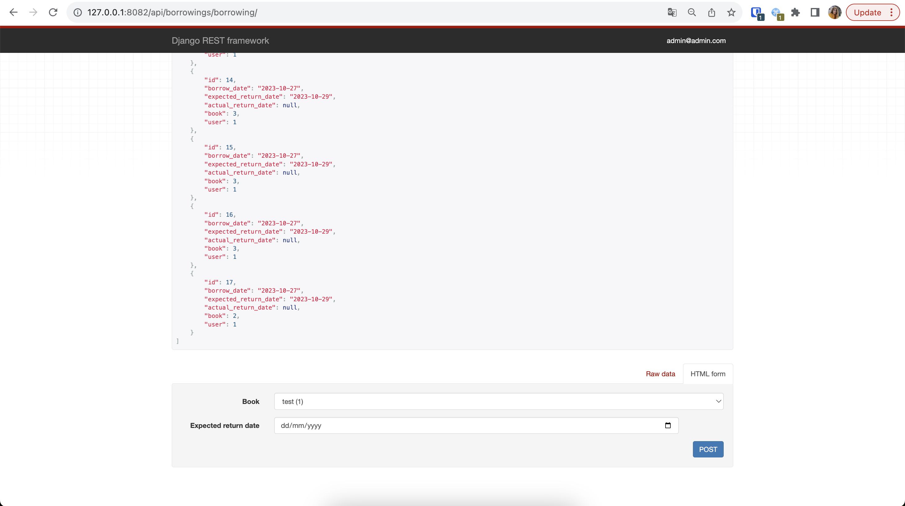
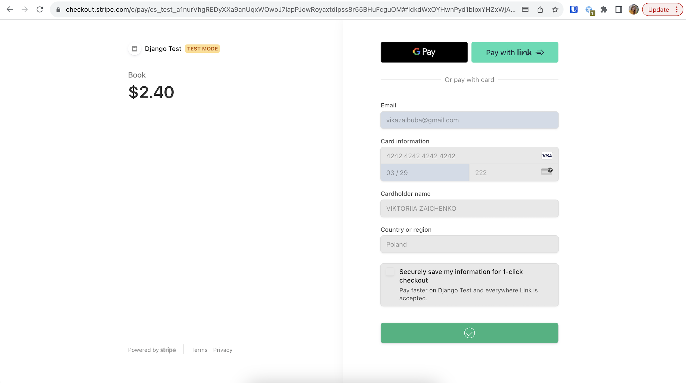
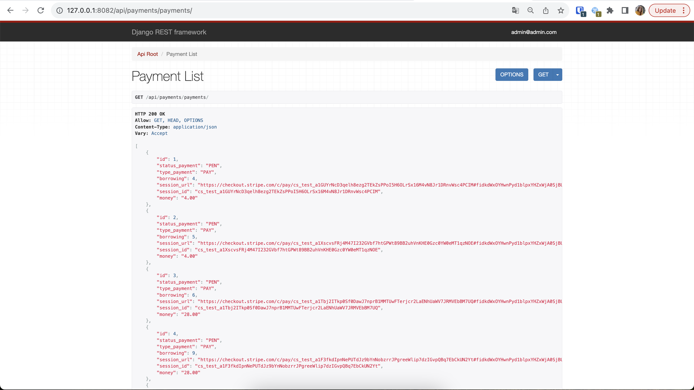
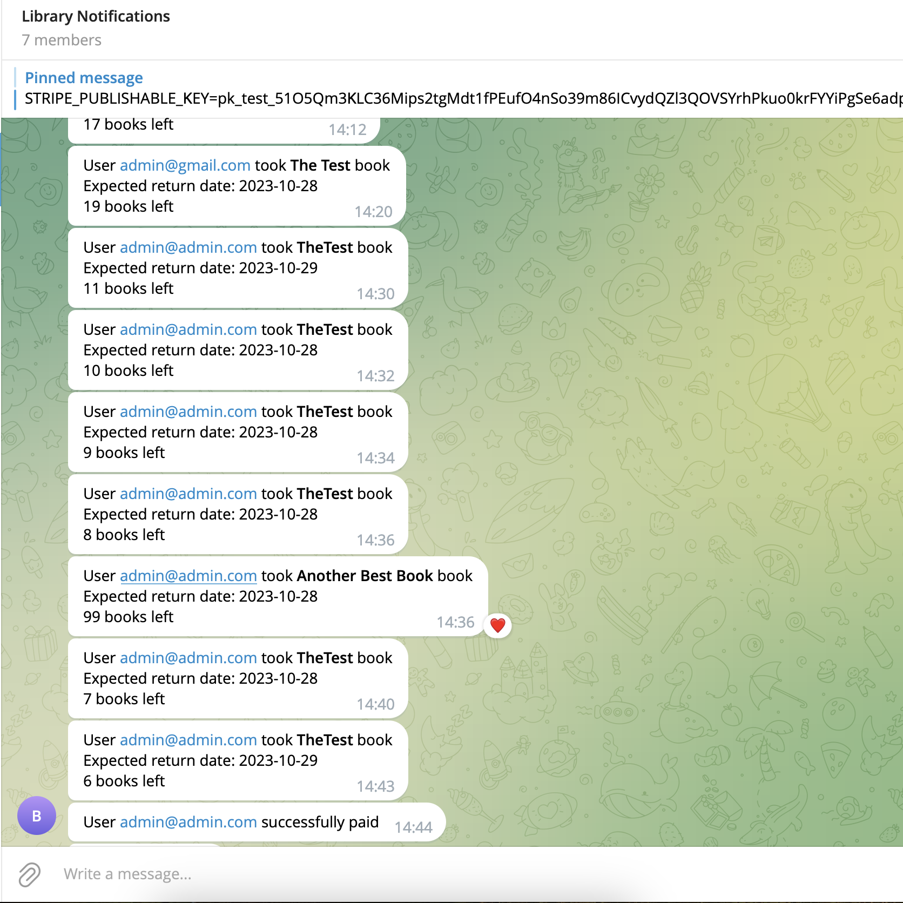

# 📚 Library Service Project
___
A modern and efficient library management system to streamline book inventory, borrowing, payments, and notifications.

## 🚀 Installation
___
To get started with the Library Service Project, follow these steps:

- Python 3 must be installed.
- Create '.env' file using a '.env.sample'.
- Run these commands:

   ```bash
   git clone https://github.com/eduardhabryd/drf-library-project.git
   cd drf-library-project
   python -m venv venv
   source venv/bin/activate  # On Windows, use venv\Scripts\activate
   pip install -r requirements.txt
   python manage.py migrate
   python manage.py runserver
   ```
- Access the application at http://localhost:8000 (or another custom host you use) in your web browser.

## 📦 Features
___

- Web-Based: Access the library service through an API interface.
- Manage Books Inventory: CRUD operations for books, including inventory management.
- Manage Books Borrowing: Borrow and return books with ease.
- User Management: Register, authenticate, and manage user profiles.
- Display Notifications: Get notifications about new borrowings, overdue books, and successful payments.
- Handle Payments: Make payments for book borrowings using Stripe integration.
- Automated Overdue Notifications: A daily task to notify users about overdue book returns.
- Telegram Notifications: Receive notifications via Telegram chat for borrowing and overdue reminders.


## 📷 Demo
___
Here are some screenshots from the Library Service Project:
___
API Root Page:

...


Book Page:



User Profile:



Borrowing and Payment:

Borrowing List:


Create borrowing:


Payment:


Payment List:


Telegram Notifications:




