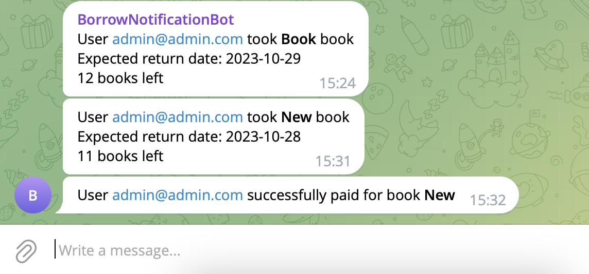

# 📚 Library Service Project
___
A modern and efficient library management system to streamline book inventory, borrowing, payments, and notifications.

## 🚀 Getting started
___

- Python 3 must be installed.
- Install Docker if it's not already installed. You can download it [here](https://www.docker.com/products/docker-desktop).
- Create `.env` file using `.env.example`:
  
  - don't change `POSTGRES_HOST` or at least make sure to have it the same as related docker container name.
- Clone repository and open folder in terminal:
```shell
git clone https://github.com/eduardhabryd/drf-library-project.git
cd drf-library-project
```

### 🐳 Run with Docker

Run the following command to build and start the Docker containers:
```shell
docker-compose up --build
```
Access the application at http://localhost:8000 (or another custom host you use) in your web browser.

## 📦 Features
___

- Web-Based: Access the library service through an API interface.
- Manage Books Inventory: CRUD operations for books, including inventory management.
- Manage Books Borrowing: Borrow and return books with ease.
- User Management: Register, authenticate, and manage user profiles.
- Display Notifications: Get notifications about new borrowings, overdue books, and successful payments.
- Handle Payments: Make payments for book borrowings using Stripe integration.
- Automated Overdue Notifications: A daily task to notify users about overdue book returns.
- Telegram Notifications: Receive notifications via Telegram chat for borrowing and overdue reminders.


## 📷 Demo
___
Here are some screenshots from the Library Service Project:
___
Book Page:


User Profile:


Borrowing and Payment:

Borrowing List:


Create borrowing:


Payment:


Payment List:


Telegram Notifications:




